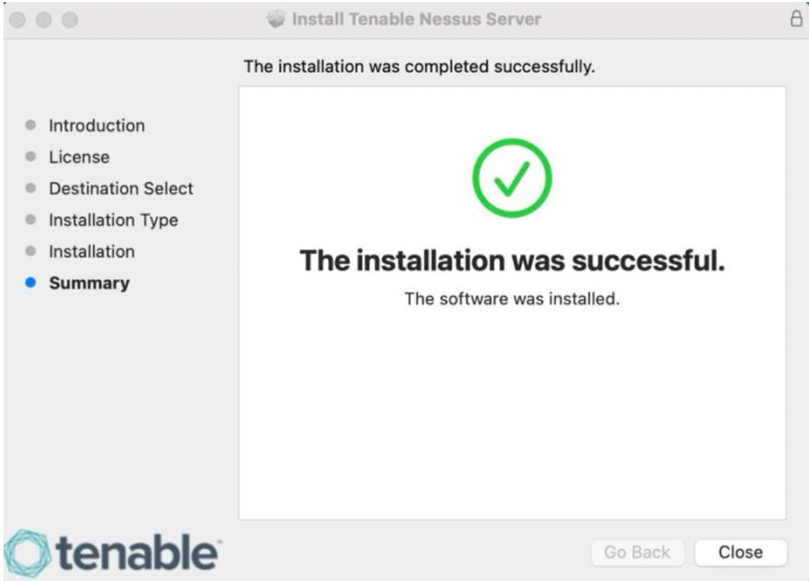
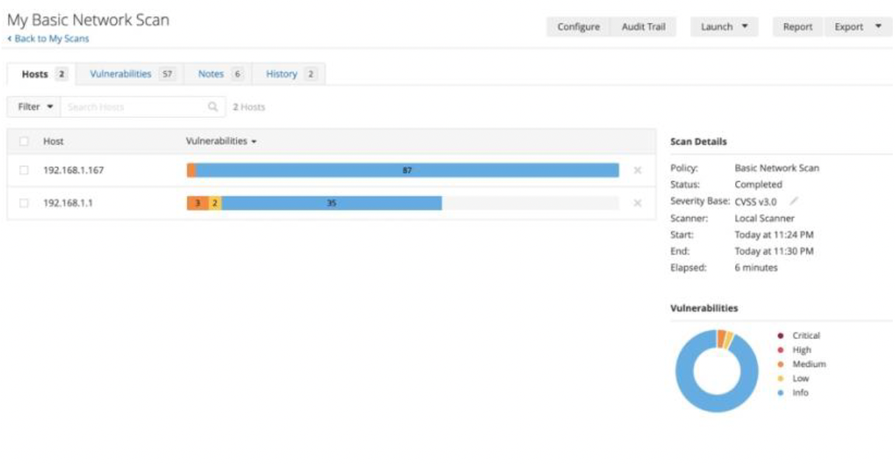
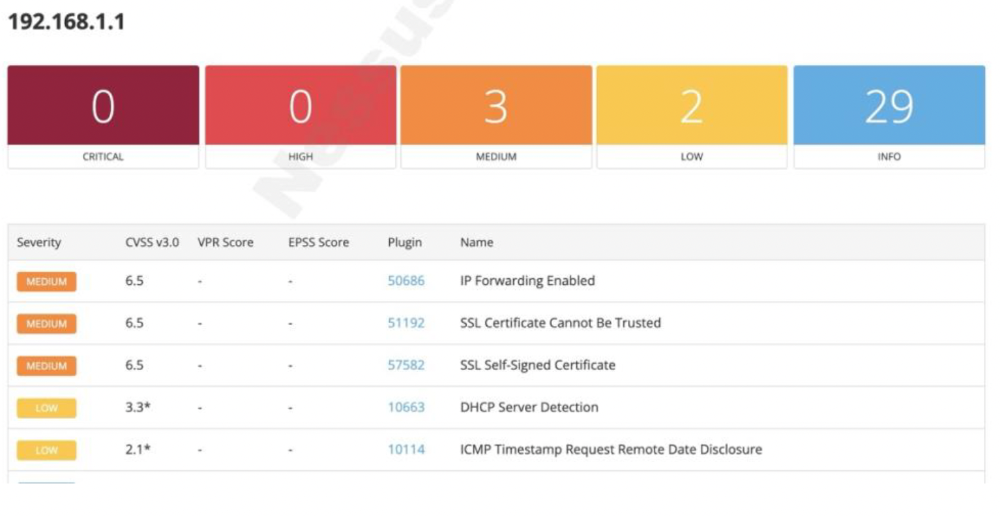

# Lab 01 — Vulnerability Scanning with Nessus

**Tool:** Tenable Nessus Essentials
**Target:** Home network router — `192.168.1.1`
**Scan type:** Basic Network Scan
**Scan duration:** 6 minutes
**Severity base:** CVSS v3.0

---

## Installation

Installed Tenable Nessus Essentials on my local machine. Activation was straightforward — Nessus runs as a local web service after installation and activation.



---

## Scan Configuration and Execution

Configured a Basic Network Scan policy targeting `192.168.1.1` (the home router/gateway). Nessus ran using a Local Scanner instance — no external credentials or agent required for this scope. The scan ran against two hosts visible on the network: `192.168.1.167` and `192.168.1.1`. This lab focuses on the router (`192.168.1.1`).



**Scan details:**
| Parameter | Value |
|---|---|
| Policy | Basic Network Scan |
| Status | Completed |
| Severity Base | CVSS v3.0 |
| Scanner | Local Scanner |
| Start | 11:24 PM |
| End | 11:30 PM |
| Duration | 6 minutes |

---

## Scan Results



```
192.168.1.1 — Summary
┌────────────┬──────┬────────┬─────┬──────┐
│  Critical  │ High │ Medium │ Low │ Info │
│     0      │  0   │   3    │  2  │  29  │
└────────────┴──────┴────────┴─────┴──────┘
```

| Severity | CVSS v3.0 | Plugin ID | Finding |
|---|---|---|---|
| Medium | 6.5 | 50686 | IP Forwarding Enabled |
| Medium | 6.5 | 51192 | SSL Certificate Cannot Be Trusted |
| Medium | 6.5 | 57582 | SSL Self-Signed Certificate |
| Low | 3.3* | 10663 | DHCP Server Detection |
| Low | 2.1* | 10114 | ICMP Timestamp Request Remote Date Disclosure |

→ [Detailed findings with CVSS breakdown and mitigations](findings/scan-findings.md)

---

## Observations

The absence of critical and high findings on a home router is expected — these devices aren't running exposed application servers or databases. The three medium findings are all SSL/TLS related and are common on consumer networking equipment that ships with self-managed certificates for its admin interface.

The more interesting exercise here is contextualizing findings. "DHCP Server Detection" has a low CVSS score and sounds alarming, but on a home router it's entirely expected. In an enterprise environment, an unexpected DHCP server on the network would warrant immediate investigation — it could be a rogue server redirecting traffic. Learning to separate signal from noise in a scan report is the skill, not just running the scan.
