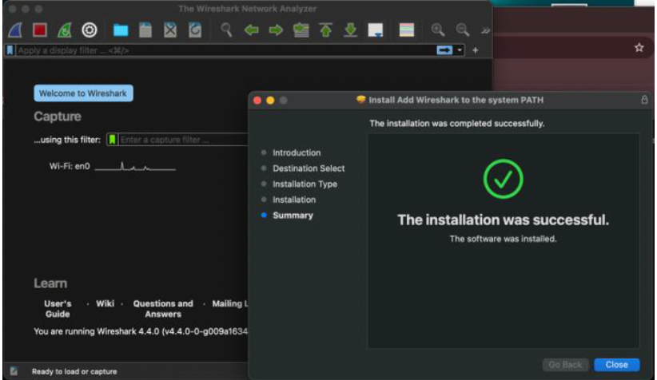
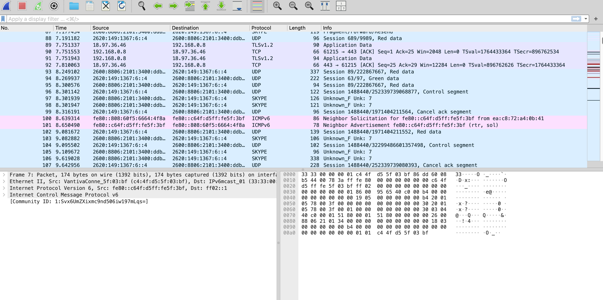
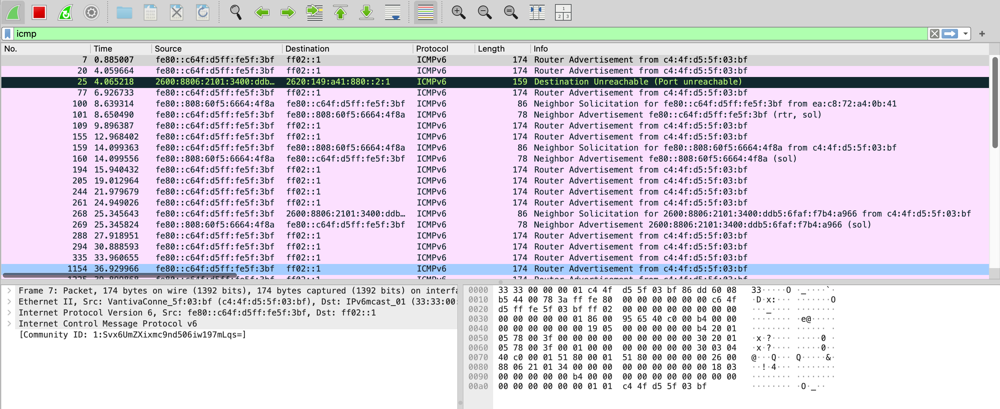
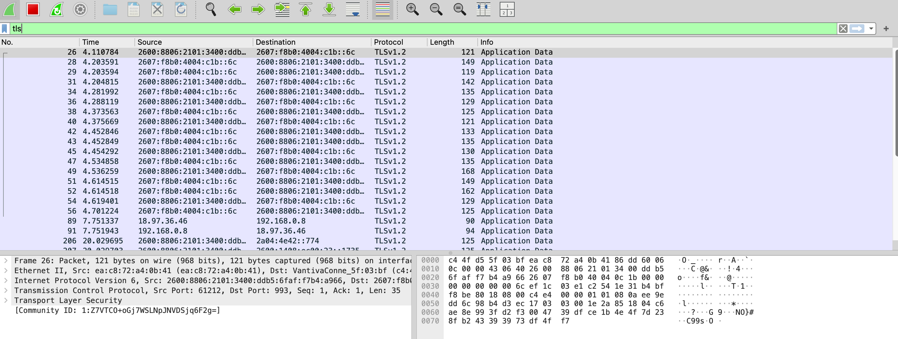
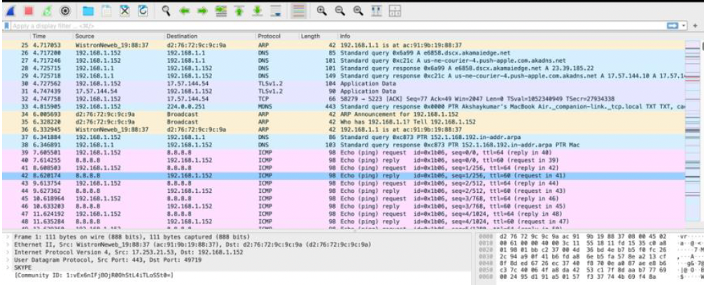

# Lab 02 — Protocol Analysis with Wireshark

**Tool:** Wireshark 4.4.0
**Capture interface:** Wi-Fi en0
**Local device:** `192.168.1.152`
**Protocols captured:** ICMP, TLS 1.2/1.3, TCP, UDP, RTP

---

## Installation

Installed Wireshark 4.4.0 on macOS. The installation includes ChmodBPF, which grants Wireshark permission to capture on network interfaces without requiring root every time.

---

## Capture Setup

Configured capture on the Wi-Fi interface (`en0`) to capture all traffic flowing through the local device. Applied display filters per protocol for analysis — the raw capture contains all traffic, and filters isolate each protocol for focused examination.

---

## Protocol Captures

### ICMP

Initiated a ping to Google's DNS server (`8.8.8.8`) from terminal while Wireshark was running. The echo request/reply pairs are immediately visible in the capture.

Key observation: TTL of 64 outbound, 60 on return — four network hops between my device and Google's DNS.

---

### TLS 1.2 / 1.3

Captured encrypted HTTPS traffic during normal web browsing. Two TLS sessions are visible: TLSv1.3 to Apple infrastructure (`17.253.23.201`) on port 443, and TLSv1.2 to `17.57.144.54` on port 5223 (Apple Push Notification Service).

---

### TCP

Opened the Maps application and captured the connection setup and data exchange. PSH/ACK flags visible throughout, clean acknowledgment progression, zero retransmissions.

---

### UDP

Streamed social media video content to `172.253.63.100`. UDP traffic visible with no handshake overhead — data flows immediately and the session terminates cleanly.

---

### RTP

Initiated a video call and captured RTP packets between local device (`192.168.1.152`) and remote device (`192.168.1.168`). RTP runs over UDP, visible in the encapsulation.

---

→ [Full protocol-by-protocol analysis with security notes](protocol-observations.md)
