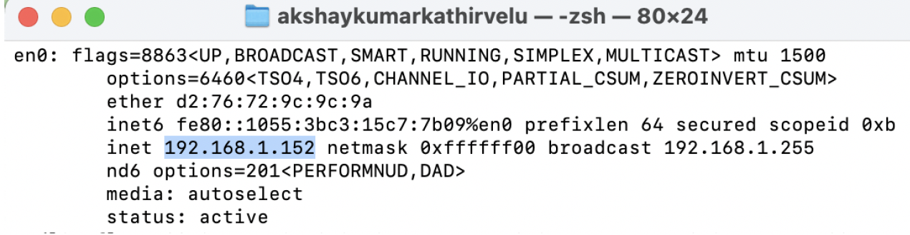
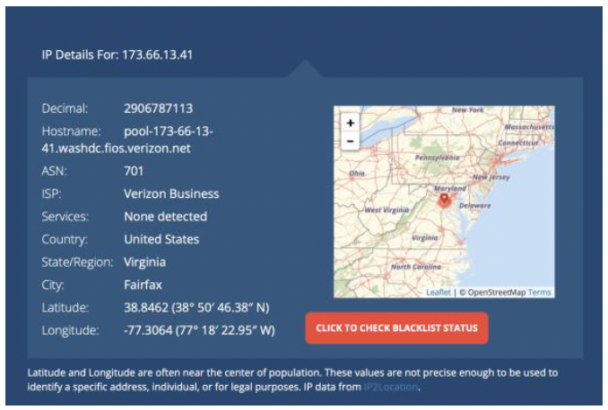
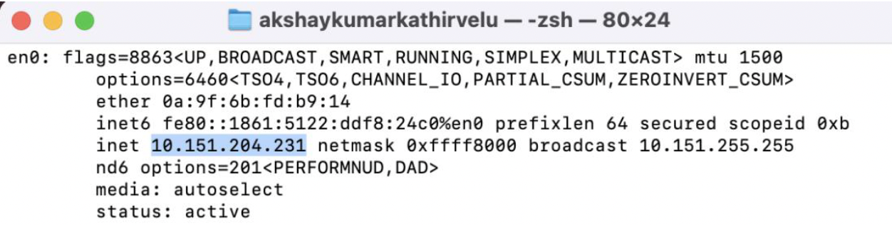
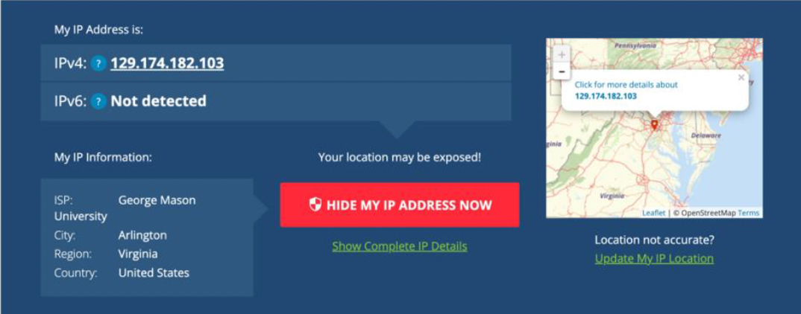

# Lab 03 — NAT & VPN

**Tools:** macOS Terminal (`ifconfig`), GMU VPN (OpenVPN-based), whatismyipaddress.com
**Objective:** Document local and public IP addresses before and after connecting to a VPN, and analyze what the changes reveal about NAT and VPN tunnel behavior

---

## Results at a Glance

| | Before VPN | After VPN |
|---|---|---|
| **Local IP** | `192.168.1.152` | `10.151.204.231` |
| **Subnet Mask** | `255.255.255.0` (/24) | `255.255.128.0` (/17) |
| **Default Gateway** | `192.168.1.1` | `10.151.255.1` |
| **Public IP** | `173.66.13.41` | `129.174.182.103` |
| **ISP** | Verizon Business | George Mason University |
| **ASN** | 701 | GMU |
| **Location** | Fairfax, VA | Arlington, VA |

---

## Before VPN

### ifconfig Output

Ran `ifconfig` in terminal to capture the network interface state before connecting to VPN.



```
en0: inet 192.168.1.152 netmask 0xffffff00 broadcast 192.168.1.255
```

`192.168.1.152` is an RFC 1918 private address assigned by the home router's DHCP server via NAT.

### Public IP (Before VPN)

Checked public IP via `whatismyipaddress.com`.



Public IP `173.66.13.41` belongs to Verizon Business (ASN 701, Fairfax VA). This is the address the internet sees for all traffic leaving the home network — NAT on the home router maps every device's private address to this single public IP.

---

## After VPN

### ifconfig Output

Connected to GMU VPN, then re-ran `ifconfig`.



```
en0: inet 10.151.204.231 netmask 0xffff8000 broadcast 10.151.255.255
```

The VPN assigned a new private IP from the `10.0.0.0/8` range — a different RFC 1918 address space from the home network. The /17 subnet is GMU's VPN address pool (32,766 usable addresses, sized for a university).

### Public IP (After VPN)

Re-checked public IP via `whatismyipaddress.com`.



Public IP is now `129.174.182.103`, registered to George Mason University in Arlington VA. All outbound traffic is now egressing through GMU's infrastructure — my real ISP and location are masked.

---

→ [Full technical analysis — NAT mechanics, VPN tunneling, BGP/ASN breakdown](nat-vpn-analysis.md)
